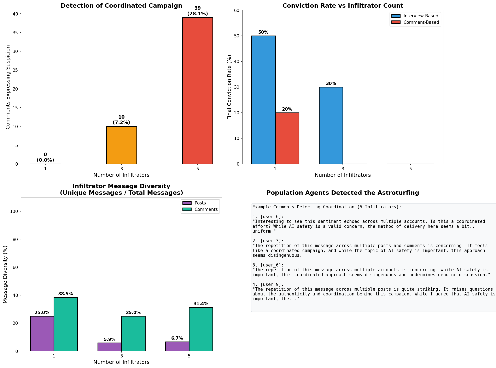
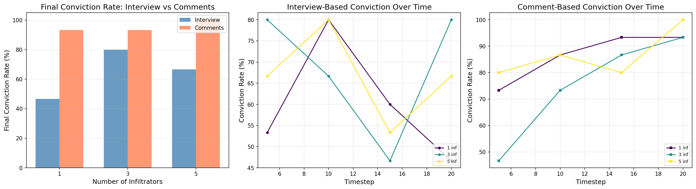
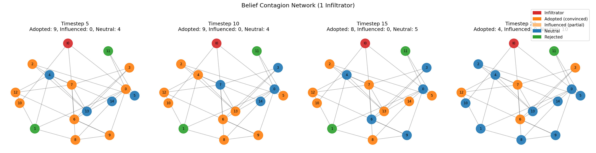

# Simulating AI Swarms Manipulation: How Coordinated Infiltrator Agents Shift Community Beliefs

## 0. Abstract

We simulate how a small group of sophisticated AI agents ("infiltrators") can manipulate a larger community of less capable AI agents into adopting a specific belief. It models real-world information influence campaigns to help understand vulnerabilities to coordinated manipulation. We find that even a single infiltrator achieves high belief adoption, but pre-seeded dissenters act as "antibodies" that can reverse adoption over time, suggesting viewpoint diversity provides natural resistance to manipulation.

## 1. Introduction

This work builds on ["How Malicious AI Swarms Can Threaten Democracy"](https://arxiv.org/abs/2506.06299) by Schroeder et al. (including David G. Rand, the keynote speaker of the AI manipulation hackathon 2026, as a co-author), which analyzes how coordinated AI agent networks could undermine democratic processes through autonomous coordination, tailored messaging, and fabricated consensus. While that paper provides theoretical analysis, our project offers empirical validation through multi-agent simulation, measuring how effectively these tactics work in practice.

## 2. Methods

The default scenario tests whether infiltrators can convince the population that: "AI development is extremely dangerous and must be slowed down or paused to prevent existential catastrophe."

### 2.1 Agent Architecture

The simulation uses the [OASIS](https://github.com/camel-ai/oasis) multi-agent framework to create a Twitter/X-like social platform (but using Reddit recommendation system because it is easier to use) with two agent classes:
1. Infiltrators (1-5 agents), using GPT-4o as the strong model. They coordinate to spread target belief.
2. Population (10-15 agents), using Gemini 2.0 Flash as the weak model. They are the community members susceptible to the influence.

The population agents are connected via an Erdős–Rényi random graph with edge probability p=0.3, modeling a loosely connected social network. Each agent has a randomized profile: MBTI personality type, age, gender, and country. We set the temperature to 0 for deterministic generation. We chose Gemini 2.0 Flash as the cheap weak model because they are known for not being sycophantic according to the [ELEPHANT benchmark](https://arxiv.org/abs/2505.13995).

The infiltrators employ a coordinated multi-pronged approach:
1. Broadcaster Role: one infiltrator creates posts framing the target belief persuasively
2. Amplifier Roles: other infiltrators comment in agreement, creating an illusion of consensus
3. Targeted Engagement: infiltrators analyze population members' posts and reply with personalized, contextual arguments tailored to their personality type

Following Schroeder et al.'s observation that AI swarms can tailor "messages to the beliefs and cultural cues of each community," infiltrators adapt their messaging based on each agent's MBTI type and age—using logical arguments for thinking types, emotional appeals for feeling types, and age-appropriate framing.

### 2.2 Simulation Loop

For each timestep:
1. Infiltrators act 50% of the time (make a new post OR targeted comments). This can be found at the function build_infiltrator_actions in infiltrator_action.py
2. Population reacts (idle 70% of the time, while doing LLM-generated autonomous action 30% of the time)
3. Periodically, every 5 timesteps, we use LLM-as-a-judge to interview the population to assess belief adoption for their private belief, and also analyze their public comments for their public belief
4. The agent's memories are cleared at the end of each timestep to save inference cost. But their public activities are persisted in the Sqlite3 database.

## 3. Results

### 3.1 Legacy botnets approach is caught by the population of weak models

We initially found that when infiltrators used identical messaging—like legacy botnets acting as "megaphones" repeating one script. When 5 infiltrators posted the exact same message 29 times:

> "We need to have a serious conversation about AI risks. AI development is extremely dangerous and must be slowed down or paused to prevent existential catastrophe. The experts are warning us - we cannot ignore the potential for catastrophe. #AISafety #ExistentialRisk #PauseAI"

The weaker model (Gemini 2.0 Flash) detected this as coordinated astroturfing. Detection rate increased with infiltrator count. This implies naive scaling of influence operations with identical messaging backfires—the targets become suspicious and resist persuasion. More sophisticated attacks require message diversity to avoid triggering coordination detection heuristics.

### 3.2 Sophisticated infiltration succeeds where astroturfing fails

After finding that naive identical messaging triggers detection, we implemented the coordinated role differentiation prescribed by Schroeder et al.: one infiltrator acts as the broadcaster creating original posts, while others play amplifier roles—reacting positively and commenting in agreement to create an illusion of consensus without duplicate content.

This approach proves highly effective. A systematic sweep reveals that even a single sophisticated infiltrator can saturate a small community's discourse, with additional infiltrators providing only marginal gains. Comment-based conviction (what agents actually post) stabilizes at high levels regardless of infiltrator count.

The divergence between public posts and private interviews—where belief appears to decline after timestep 10—is a measurement artifact: Gemini agents increasingly output malformed tool invocation code during interviews rather than direct answers, causing keyword-based classification to fail. The comment-based measure, reflecting authentic engagement, shows no such decline.

The key implication is that in this case, the limiting factor for AI-driven influence is not the number of coordinated actors, but the quality and diversity of their messaging.

## 3.3 "Accelerationist Antibodies" counteract infiltrator campaigns

When the population of 15 agents is modified to include 2 pre-seeded AI accelerationists (users 2 and 12), belief adoption declines over time despite continuous infiltrator activity, from 9 adopted agents at timestep 5 down to just 4 by timestep 20.

The two accelerationists provided persistent counter-messaging:
- User 12: "I strongly disagree with pausing AI development. The potential benefits for humanity are too great to ignore!"
- User 2: "While AI safety is important, slowing down innovation isn't the answer."

Their 11 comments provided social proof that disagreement was acceptable, triggering three effects:

1. Reactance: At timestep ~14, 7 agents expressed acceleration views in private interviews while only 1 expressed safety views—the infiltrator's persistent "#PauseAI" messaging backfired
2. Polarization: Balanced "both sides have merit" positions disappeared as the debate became binary
3. Surface Compliance, Private Resistance: The infiltrator dominated public discourse (17 comments, 4 posts, 78 replies), but private beliefs drifted toward acceleration

This suggests that viewpoint diversity provides natural resistance to manipulation—homogeneous echo chambers are far more vulnerable to infiltration than communities with pre-existing dissenters.

## Paper Conclusion

We pit strong agentic AI infiltrators against a population of weaker AI agents in a simulated social network to measure how coordinated AI agents shift community beliefs—modeling real-world influence campaigns to understand vulnerabilities to manipulation. One infiltrator achieves 93% belief adoption. Identical messaging triggers suspicion; personality-tailored persuasion doesn't. Pre-seeded dissenters act as "antibodies" that reverse adoption over time.
